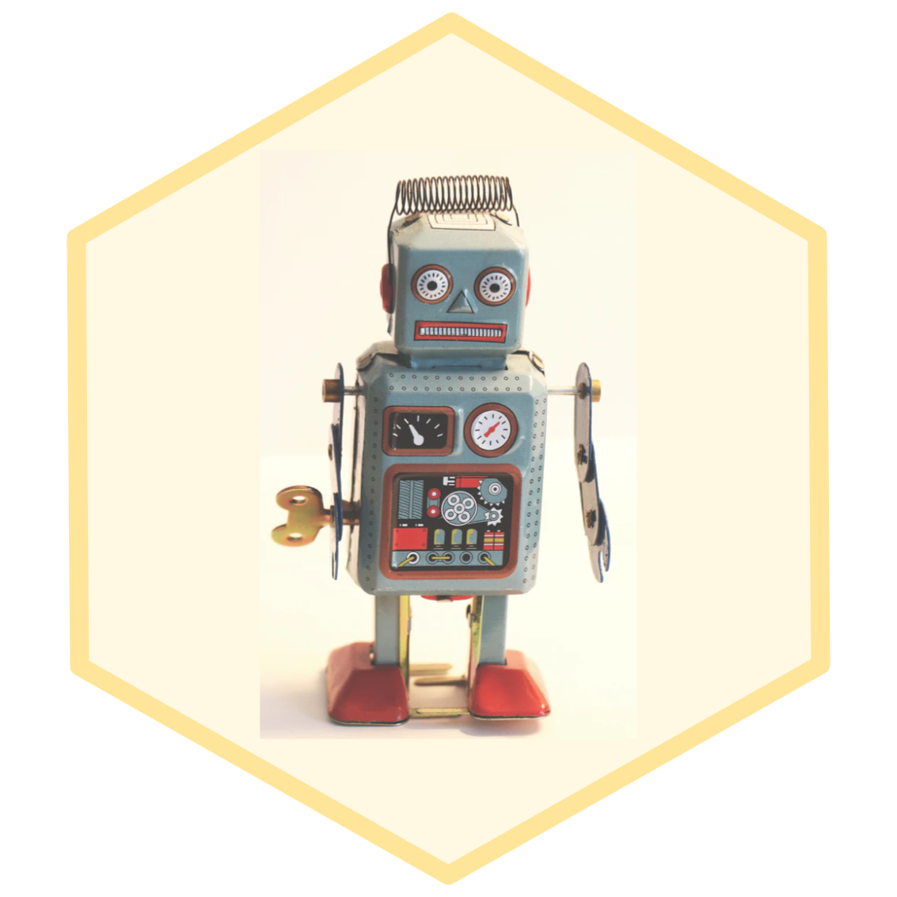

```{r setup, include=FALSE}
knitr::opts_chunk$set(echo = FALSE, 
                      message = FALSE, 
                      warning = FALSE)
```


```{css}

@import url('https://fonts.googleapis.com/css?family=Inconsolata|Londrina+Solid&display=swap');


h1, h2, h3{
  font-family: 'Londrina Solid', cursive;
}

h3 {
  color: #666666;
}

h4 {
  font-family: 'Inconsolata', monospace;
  font-weight: bold;
}

.btn-primary {
  background-color: #ffe599;
}

.btn-primary:hover, .btn-primary:focus {
  background-color: #ffe599;
  opacity: 0.8;
}

.myButtonSelected {
  background-color:#666666;
}

.myButtonSelected:hover, .myButtonSelected:focus{
  background-color:#666666;
}

body, .btn{
  font-family: 'Inconsolata', monospace;
  font-size: 16px;
}

a {
  color: #000000;
  font-weight: bold;
  background-color: #F0F0F0;
}

a:hover, a:focus {
  color: #000000;
  opacity: 0.8;
}

blockquote {
  font-size: 16px;
  background-color: #fff8e3;
  padding: 10px;
  color: #000000;
}

.highlight {
  background-color: #fff8e3;
}

td {
  padding: 10px;
}

tr {
  border: solid #ddd 1px;
}

.center-align{ text-align:center;}
```

:::: {.row}

::: {.col-md-4}

{style=width:200px}

[Link to the workshop app](index_app.html)

:::

::: {.col-md-8}

In this two-hour workshop, you’ll get to try out some of the learning tasks from the first week of STATS 100 Concepts in Statistics AKA the Year 13 Statistics course of my dreams! With a focus on modern data contexts and integrating statistical and computational thinking, we’ll explore time series data using a range of digital technologies and statistical methods. Come for a fun introduction to data science, including accessing and using a wide range of modern engaging data sources applicable beyond time series; leave with some new ideas and resources for teaching time series. You will need to bring a WIFI-enabled laptop for this workshop.

> I'll be updating this page with links and resources after the workshop. Feel free to email me with any questions: Anna Fergusson, Department of Statistics, University of Auckland, a.fergusson@auckland.ac.nz.

:::

::::
